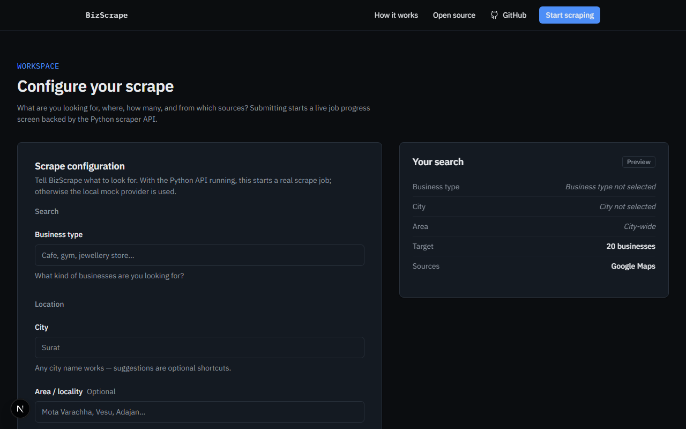
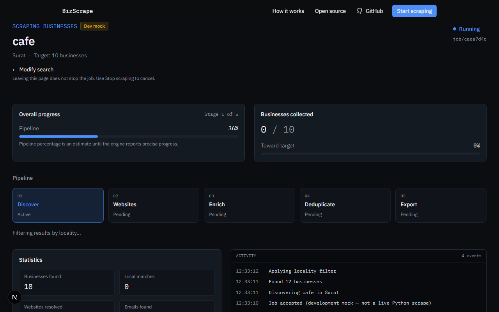
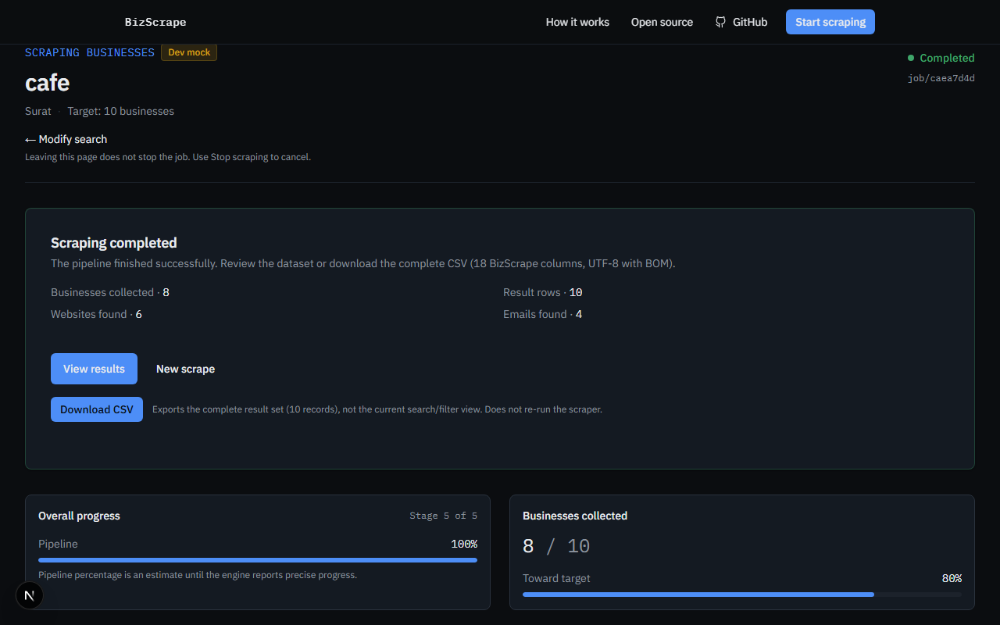
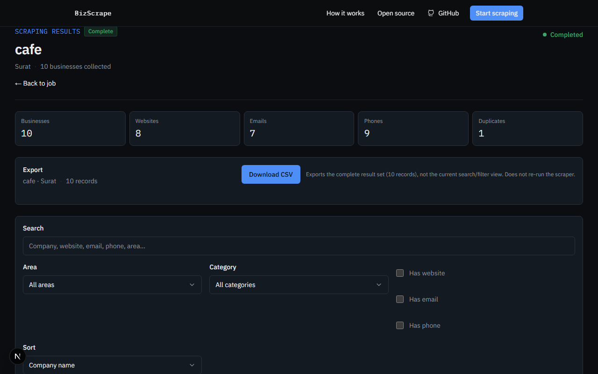
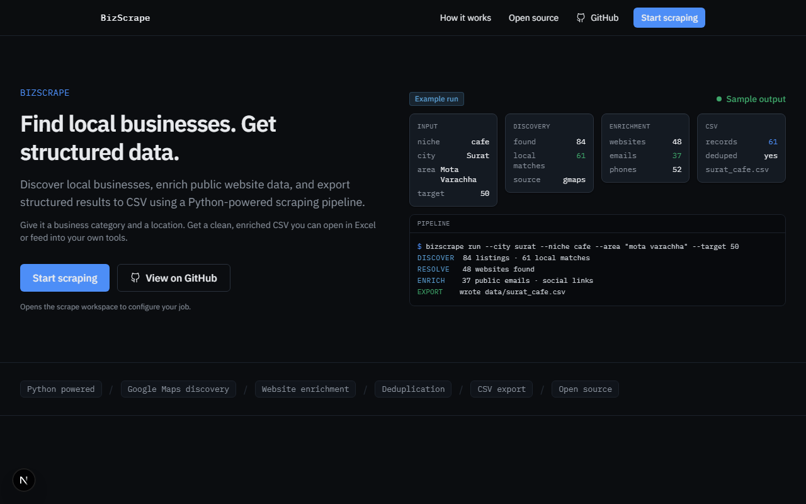

# BizScrape Web

A web interface for the open-source BizScrape Python business-discovery and enrichment engine.

[](https://github.com/mayurnakum07/BizScrape/actions/workflows/ci.yml)
[](LICENSE)
[](https://nodejs.org/)
[](https://www.python.org/)

Configure a scrape in the browser, watch a live job, inspect results, and download an Excel-friendly CSV. Scraping itself still runs in Python — this repo does not reimplement the engine in JavaScript.

## What this is (and is not)

| | |
|--|--|
| **BizScrape** | Open-source Python tooling that discovers local businesses (Google Maps today), resolves websites, enriches public contact details, and writes CSV. |
| **This repository** | Next.js UI + FastAPI job API wrapped around that same Python engine. The original CLI (`bizscrape`) remains available. |

This is **not** an AI product. It is browser automation, HTTP enrichment, and structured export.

Project home: [github.com/mayurnakum07/BizScrape](https://github.com/mayurnakum07/BizScrape)

## Why it exists

The CLI is solid for developers who live in a terminal. Operators who want a form, live progress, and a results table need a UI. BizScrape Web is that UI — thin on the frontend, honest about what the Python pipeline can and cannot do.

## Features

- Scrape configuration form (business type, city, area, target, sources)
- Live job progress over **SSE** (stages, stats, activity log)
- Results table/cards with search, filters, and sort
- CSV download (18 columns, UTF-8 with BOM, formula-safe)
- Cancel / retry job flows
- Local **mock provider** when the API URL is unset (UI development without Maps)
- Same engine as the CLI (`src/bizscrape/`)

## Screenshots

Real UI captures (job screenshots use the local mock provider so docs do not depend on live Maps).

| Configuration | Running job |
|---------------|-------------|
|  |  |

| Completed job | Results + CSV |
|---------------|---------------|
|  |  |

Landing page: 

## Architecture

```text
Browser
   ↓
Next.js (App Router UI)
   ↓  REST + SSE
Python FastAPI
   ↓  JobManager (in-process)
BizScrape engine
   ↓  Playwright + httpx
External sources → results → CSV
```

| Piece | Role |
|-------|------|
| **Frontend** | Next.js UI, mock or remote job provider, CSV client export |
| **API** | FastAPI routes, validation, rate limits, SSE event stream |
| **Engine** | Discovery → website lookup → enrichment → dedupe → export |
| **Jobs** | Background scrapes; state is **in-memory** per API process |
| **Events** | Server-Sent Events for live progress |
| **Results** | Structured business records tied to a job ID |
| **Export** | Server CSV under `JOB_DATA_DIR` and/or browser Blob download |

Details: [docs/ARCHITECTURE.md](docs/ARCHITECTURE.md) · Deployment: [docs/DEPLOYMENT.md](docs/DEPLOYMENT.md)

## Requirements

| Tool | Version |
|------|---------|
| Node.js | **20.9+** (LTS recommended) |
| npm | Bundled with Node |
| Python | **3.10+** |
| Playwright Chromium | For live discovery (`playwright install chromium`) |

## Local setup

### 1. Clone and install Python

```bash
git clone https://github.com/mayurnakum07/BizScrape.git
cd BizScrape

python -m venv .venv
# Windows PowerShell
.\.venv\Scripts\Activate.ps1
# macOS / Linux
# source .venv/bin/activate

pip install -e ".[dev]"
playwright install chromium
```

### 2. Environment file

```bash
# Windows
copy .env.example .env.local
# macOS / Linux
# cp .env.example .env.local
```

Edit at least:

```text
NEXT_PUBLIC_API_URL=http://127.0.0.1:8000
ALLOWED_ORIGINS=http://localhost:3000,http://127.0.0.1:3000
```

Full variable reference: [docs/ENVIRONMENT.md](docs/ENVIRONMENT.md) and [`.env.example`](.env.example).

### 3. Start the Python API

```bash
python -m bizscrape.api
```

- Health: http://127.0.0.1:8000/health  
- Readiness: http://127.0.0.1:8000/health/ready  
- OpenAPI docs: only when `DEBUG=true` → http://127.0.0.1:8000/docs  

### 4. Start the Next.js UI

In a second terminal (repo root, Node 20.9+):

```bash
npm install
npm run dev
```

Open http://localhost:3000

**UI-only mode:** leave `NEXT_PUBLIC_API_URL` empty to use the mock job provider (no Python API, no Maps).

## How scraping works

Pipeline stages (same as the CLI):

```text
Discover → Website lookup → Enrich → Deduplicate → Export
```

1. **Discover** — Playwright searches configured sources (Google Maps today) for listings matching business type + location.
2. **Website lookup** — Fill missing website URLs when listings omit them.
3. **Enrich** — Fetch public company websites and extract emails, phones, social links when present.
4. **Deduplicate** — Collapse near-duplicates.
5. **Export** — Write the 18-column CSV.

Emails come from **company websites**, not from Maps listing fields. Empty emails are normal when a site does not publish one.

Schema: [docs/DATA_SCHEMA.md](docs/DATA_SCHEMA.md) · Pipeline notes: [docs/SCRAPE_JOB.md](docs/SCRAPE_JOB.md)

## CLI (same engine)

After `pip install -e ".[dev]"` with the venv activated:

```bash
python -m bizscrape run --city surat --niche cafe --areas "Mota Varachha" --target 20 --yes
# or
bizscrape run --city surat --niche cafe --target 20 --yes
# or
python main.py run --city surat --niche cafe --target 20 --yes
```

```bash
python -m bizscrape --help
```

## Project structure

```text
app/                  Next.js App Router
components/           UI (landing, scrape form, job, results)
services/             Job/results providers + CSV export helpers
hooks/                Client hooks
lib/                  Env, errors, constants
types/                Shared TypeScript contracts
src/bizscrape/        Python package
  api/                FastAPI + JobManager + SSE
  engine.py           Programmatic scrape entry
  sources/            Discovery
  enrichment/         Website contact extraction
  store.py            CSV persistence
main.py               CLI entry
docs/                 Architecture, deploy, testing, schema
e2e/                  Playwright E2E (mock provider)
tests/unit/           Frontend Vitest
tests/python/         Pytest (unit + integration; live optional)
Dockerfile            Python API image
```

## Configuration (quick)

| Variable | Who | Public? | Purpose |
|----------|-----|---------|---------|
| `NEXT_PUBLIC_SITE_URL` | Next.js | Yes | Canonical site URL |
| `NEXT_PUBLIC_API_URL` | Next.js | Yes | Python API base (empty = mock) |
| `NEXT_PUBLIC_SSE_MAX_RECONNECT_ATTEMPTS` | Next.js | Yes | SSE reconnect budget |
| `API_URL` | Next.js server | No | Optional server-side API base |
| `HOST` / `PORT` | Python API | No | Bind address |
| `ALLOWED_ORIGINS` | Python API | No | CORS allow-list (never `*`) |
| `DEBUG` | Python API | No | OpenAPI docs when `true` |
| `JOB_DATA_DIR` | Python API | No | Per-job CSV root |
| `MAX_CONCURRENT_JOBS` | Python API | No | Parallel scrapes |

See [docs/ENVIRONMENT.md](docs/ENVIRONMENT.md).

## Testing

Default suites **do not** hit Google Maps or live websites.

```bash
npm run lint
npm run typecheck
npm test                 # frontend unit
npm run build
npm run test:e2e         # Playwright against production build + mock provider
python -m pytest tests/python -q   # excludes @pytest.mark.live
```

Live scraper (manual, network required):

```bash
# Windows PowerShell
$env:BIZSCRAPE_LIVE_TESTS=1; python -m pytest tests/python/live -m live -q
# macOS / Linux
# BIZSCRAPE_LIVE_TESTS=1 python -m pytest tests/python/live -m live -q
```

Guide: [docs/TESTING.md](docs/TESTING.md)

## Deployment

Intended shape: **Next.js frontend** + **long-running Python API** (not serverless for scrapes).

- Playwright/Chromium on the API host
- SSE-friendly reverse proxy
- Explicit CORS origins
- Single API instance (in-memory jobs)

See [docs/DEPLOYMENT.md](docs/DEPLOYMENT.md) and [docs/SMOKE_TEST.md](docs/SMOKE_TEST.md).

## Limitations

Be specific about what breaks:

- Source sites can **block**, rate-limit, or change layout — scrapes fail or return fewer rows.
- Website enrichment often finds **no email**; that is expected for many SMEs.
- Job state is **in-memory** — API restart loses active/completed job metadata (CSV files on disk may remain).
- Designed for a **single API process**; no multi-instance sticky session story yet.
- Browser automation needs Chromium (or configured Chrome/Edge) and enough RAM/CPU for long jobs.
- Free-tier hosts that **sleep** will kill in-flight scrapes.
- No user accounts yet — anyone who can reach the API can create jobs unless you restrict the network.

## Responsible use

- Target **public** business listing and website data only.
- Respect source terms of use and robots/rate expectations.
- Do not use this to hammer third-party sites or bypass access controls.
- Results depend on what is published and reachable today.
- Handle exported CSV (third-party contact data) carefully under applicable law.

More: [docs/RESPONSIBLE_USE.md](docs/RESPONSIBLE_USE.md)

## Contributing

See [CONTRIBUTING.md](CONTRIBUTING.md). Please read [CODE_OF_CONDUCT.md](CODE_OF_CONDUCT.md).

## Security

Report vulnerabilities privately — see [SECURITY.md](SECURITY.md). Do not file public issues with credentials or scraped personal datasets.

## Releases

Versioning and tags: [CHANGELOG.md](CHANGELOG.md). Web UI and Python package currently share this repository; release notes should call out which surface changed (UI, API, CLI/engine). Git tags (`v0.1.0`) map to GitHub Releases — do not invent a history that was never tagged.

## License

[MIT](LICENSE) — Copyright (c) 2026 BizScrape Contributors.
